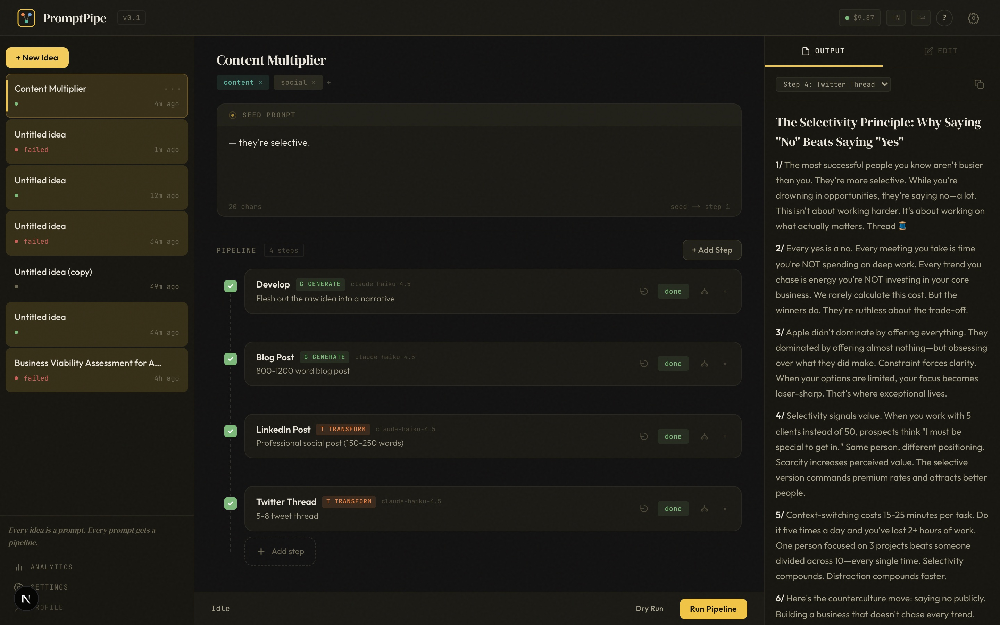

# PromptPipe

> This started as a private project I built for myself, but I figured — why not share it with the world? So here it is. I'll be doing my best to maintain it, and I'd love outside help. If you want to contribute, please [submit a PR](https://github.com/anurieli/prompt-pipe/pulls)!

**Stop copy-pasting between AIs. Build pipelines for your prompts.**

You copy output from ChatGPT, paste it into Claude, tweak the prompt, paste that into Perplexity, lose track of what you changed, and start over when step 2 needs a different angle. Every. Single. Time.

PromptPipe chains those steps into a reusable pipeline. One input triggers the whole sequence — research in Perplexity, synthesis in Claude, reformatting for LinkedIn — with the right model at each stage. You see every intermediate result, edit anything mid-flow, and rerun from any step without starting over.

<p align="center">
  
</p>

> **Early access.** This project is under active development. The core pipeline engine works, but expect rough edges — some features are partially implemented, the UI is functional but not polished, and things may need maintenance. If you fork this, expect to get your hands dirty. PRs and issues welcome.

---

## How It Works

1. **Drop in an idea** — any raw text, question, or topic
2. **Build a pipeline** — chain AI models with intent-based node types (Research, Analyze, Generate, Transform)
3. **Run it** — each step feeds the next automatically, with its own model and prompt template
4. **Stay in control** — inspect every intermediate result, edit and rerun from any stage

Describe your idea and let AI design the pipeline for you, or pick a **Starter Pipe** to get going instantly.

---

## Why Pipelines Beat Single Prompts

- **Right model for each job.** Perplexity for research, Claude for analysis, GPT for drafting — each step uses the model best suited for that task.
- **Edit without restarting.** Change step 2? Rerun from there. The rest of the pipeline picks up where you left off.
- **Reusable workflows.** Build a pipeline once, run it on every new idea.
- **No black boxes.** You see every intermediate output. Human-in-the-loop at every stage, not fire-and-forget.

---

## Demo: Starter Pipes in Action

PromptPipe ships with **7 pre-built pipelines** you can run immediately. Here's what they look like:

### Deep Research
> **Prompt:** *"What's the current state of nuclear fusion energy?"*
>
> `Research` (Perplexity Sonar Pro) → `Synthesize` (Claude Sonnet)
>
> Grounded web research piped into a structured executive brief — key findings, supporting evidence, and open questions. No more Perplexity tab → Claude tab → "summarize this" dance.

### Content Multiplier
> **Prompt:** *"I think most productivity advice is backwards — people don't need more systems, they need fewer commitments"*
>
> `Develop` → `Blog Post` → `LinkedIn Post` → `Twitter Thread`
>
> One idea in, four pieces of content out. Each format optimized for its platform, all from a single seed thought.

### Competitive Analysis
> **Prompt:** *"Figma vs Canva vs Framer for startup landing pages"*
>
> `Research Competitors` (Perplexity) → `Strategic Analysis` (Claude)
>
> Live market research auto-fed into a structured competitive breakdown — players, strengths/weaknesses, gaps, and strategic recommendations.

### Idea Developer
> **Prompt:** *"What if there was a Spotify Wrapped but for your AI usage across tools?"*
>
> `Explore` → `Structure`
>
> Takes any half-baked thought and gives it a thesis, key arguments, objections, and next steps. For when you have a shower thought but not a plan.

### Meeting Notes → Actions
> **Prompt:** *Paste a raw meeting transcript*
>
> `Extract` → `Format Summary`
>
> Pulls out decisions, action items (with owners), and open questions. Formats them into something you can actually send to the team.

### Code Explainer
> **Prompt:** *Paste a function or module*
>
> `Analyze Code` → `Generate Docs`
>
> Deep code analysis piped into documentation with usage examples. For when the codebase has zero comments and you need to understand what it does.

### Debate / Steel Man
> **Prompt:** *"Should startups use AI agents to replace junior developers?"*
>
> `Steel Man` → `Verdict`
>
> The strongest case for AND against, argued with genuine conviction on both sides. Then a nuanced synthesis and recommendation. For when you want to pressure-test your own takes.

---

## Node Types

Each step in a pipeline is a node with an intent:

| Node | Purpose | Best For |
|------|---------|----------|
| **Research** | Deep info gathering, fact-finding, source synthesis | Perplexity Sonar Pro, Claude |
| **Analyze** | Reasoning, comparison, evaluation, structured thinking | Claude, o3-mini, Gemini Pro |
| **Generate** | Create new content — writing, drafting, ideating | Claude, GPT-4o |
| **Transform** | Reshape — summarize, translate, reformat, extract | Claude Haiku, GPT-4o-mini |
| **Webhook** | POST to Slack, Notion, any HTTP endpoint | — |
| **Script** | Run JS, Python, or shell transforms | — |

All AI nodes route through [OpenRouter](https://openrouter.ai) — 200+ models from every major provider through a single API key.

---

## Getting Started

### Prerequisites

- **Node.js 18+**
- A free **[Convex](https://convex.dev)** account (real-time backend)
- An **[OpenRouter](https://openrouter.ai)** API key (for running pipelines)

### Setup

```bash
# Clone the repo
git clone https://github.com/anurieli/prompt-pipe.git
cd prompt-pipe

# Install dependencies
npm install

# Start the Convex backend (follow prompts to create a project)
npx convex dev

# In a new terminal — start the dev server
npm run dev
```

### API Keys

**You bring your own keys. PromptPipe does not ship with or include any API keys.**

1. Open the app at `http://localhost:3000`
2. Go to **Settings** (gear icon in the sidebar)
3. Add your **OpenRouter API key** — get one free at [openrouter.ai/keys](https://openrouter.ai/keys)

Your API key is encrypted with **AES-256-GCM** before being stored. It is never saved in plaintext and never leaves the server.

To set up encryption for your deployment:

```bash
# Generate a 256-bit key
node -e "console.log(require('crypto').randomBytes(32).toString('hex'))"

# Set it in Convex
npx convex env set ENCRYPTION_KEY <your-key-here>
```

### Then What?

Create a new idea → pick a starter pipe (or build your own from scratch) → hit Run.

---

## Tech Stack

| Layer | Tech |
|-------|------|
| Framework | [Next.js 16](https://nextjs.org) (App Router) |
| Language | TypeScript (strict mode) |
| Backend | [Convex](https://convex.dev) — real-time reactive database + server functions |
| Styling | Tailwind CSS 4 |
| AI Models | [OpenRouter](https://openrouter.ai) — 200+ models, single API |
| Validation | Zod + Convex schema validation |

---

## Project Structure

```
src/
├── app/              # Next.js pages (main app, settings, analytics)
│   ├── analytics/    # Analytics page — usage tracking and cost breakdown
│   └── settings/     # Settings page with TOC navigation
├── components/       # React components (queue, pipeline, modals, layout, analytics)
│   └── analytics/    # StatCards, UsageByModel, UsageOverTime
├── config/           # Provider definitions, model lists, starter pipes
├── hooks/            # Pipeline execution hook
├── stores/           # Zustand (ephemeral UI state)
├── types/            # Shared TypeScript types
└── lib/              # Validators, pipeline utilities, formatting

convex/
├── schema.ts         # Database schema (8 tables including usageRecords)
├── analytics/        # Usage tracking — mutations + aggregation queries
├── ideas/            # Idea CRUD
├── steps/            # Pipeline step management
├── threads/          # Thread management per step
├── pipeline/         # Execution engine (writes usage records on completion)
├── settings/         # Encrypted API key storage
└── lib/              # Server-side providers + utilities
```

---

## Analytics

PromptPipe tracks every LLM invocation with full token and cost accounting:

- **Per-model tracking** — input tokens, output tokens, cost, duration, and timestamp for every model used
- **Only used models appear** — no empty rows for models you haven't tried
- **Persistent history** — usage records survive pipeline resets and re-runs
- **Dashboard** — stat cards, per-model breakdown table, and a 30-day usage chart at `/analytics`
- **Settings integration** — compact usage overview in the settings page with a link to the full dashboard

See [`src/app/analytics/README.md`](src/app/analytics/README.md) for full technical documentation.

---

## Known Limitations

This is a solo project in active development. Current state:

- **No authentication** — single-user only (SaaS conversion is planned)
- **Pipeline execution** depends on OpenRouter availability and rate limits
- **Some UI interactions** may be rough or incomplete
- **Error recovery** during pipeline runs is minimal
- **No deployment guide yet** — local dev only for now

---

## Contributing

This is early-stage and moving fast. If something's broken, open an issue. If you want to contribute, PRs are welcome — just know the codebase is evolving.

---

## License

MIT

---

*Built by [@anurieli](https://github.com/anurieli)*
